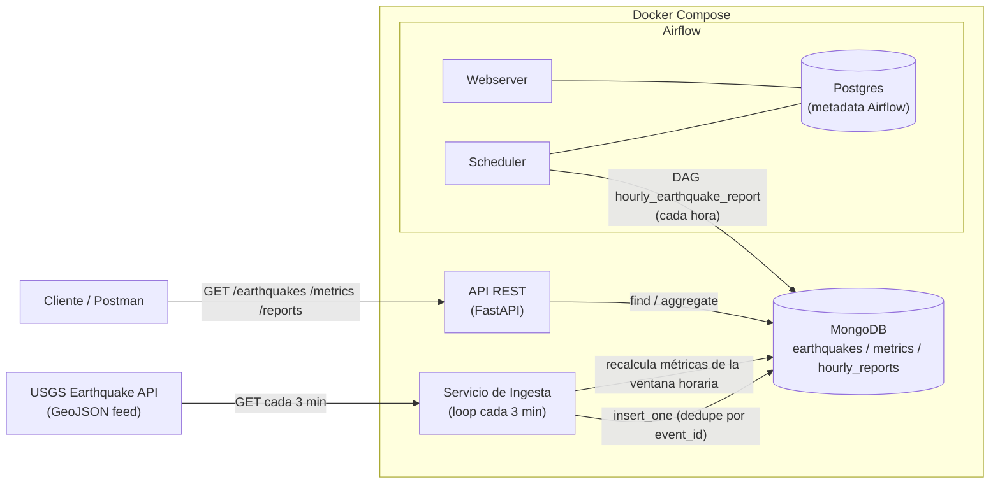

# Diagrama de arquitectura

## Flujo

1. El **servicio de ingesta** consulta el feed del USGS cada 3 minutos,
   transforma cada feature a un modelo interno (Pydantic), descarta
   duplicados (`event_id` único) y guarda los eventos nuevos en
   `earthquakes`.
2. Tras cada ciclo con eventos nuevos, recalcula las **métricas** de la(s)
   ventana(s) horaria(s) afectadas (conteo, promedio, máximo, distribución
   por rango de magnitud) y las guarda (upsert) en `metrics`.
3. La **API REST** (FastAPI) solo lee de MongoDB: expone `/earthquakes`,
   `/metrics` y `/reports` con filtros, orden y paginación.
4. **Airflow** ejecuta cada hora el DAG `hourly_earthquake_report`, que lee
   los eventos de la hora anterior y genera/actualiza el reporte consolidado
   en `hourly_reports` (top ubicaciones, promedio y máximo de magnitud).
5. Airflow usa su propia base **Postgres** para metadata (scheduler, DAG
   runs), completamente separada de los datos de la aplicación en MongoDB.
